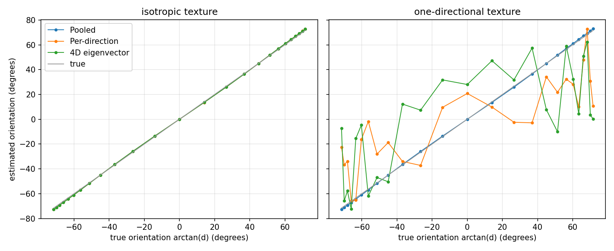
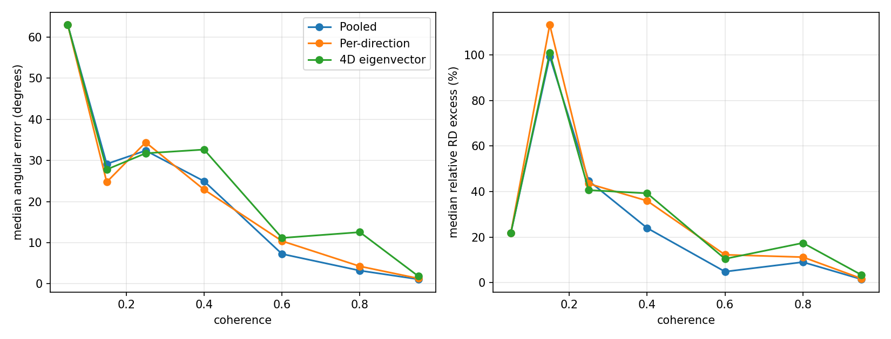
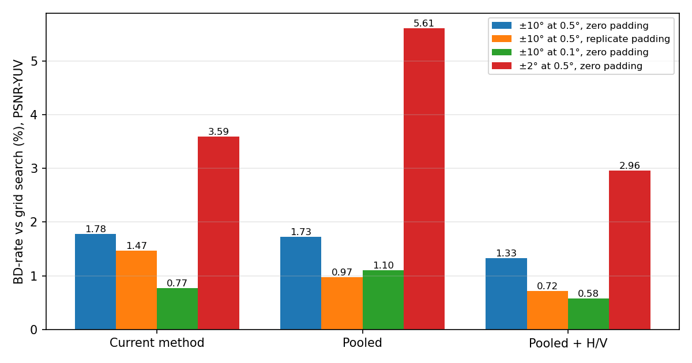
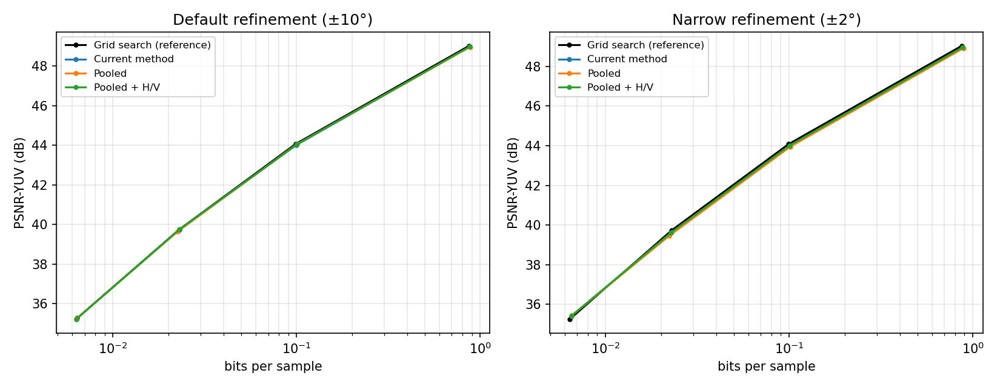
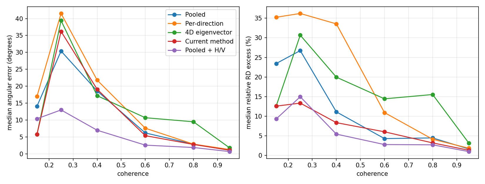

# Structure-tensor orientation estimation: investigation report

This report records an investigation into how the encoder estimates the EPI orientation (the
transform angle) from the structure tensor. It started as a logging fix, turned into an
ablation of three orientation estimators, and along the way found several defects in the
encoder. Each section states what was measured, how, and how far the result can be trusted.

All experiments in this report use a single 128×128 crop of one light field. They are good
evidence about mechanisms and defects, and weak evidence about final coding gains. The
limitations are listed in [Section 9](#9-limitations-and-open-items).

## Contents

1. [Setup](#1-setup)
2. [Partition information logging](#2-partition-information-logging)
3. [The three orientation estimators](#3-the-three-orientation-estimators)
4. [Verification of the tooling](#4-verification-of-the-tooling)
5. [Controlled synthetic experiment](#5-controlled-synthetic-experiment)
6. [First ablation, before the fixes](#6-first-ablation-before-the-fixes)
7. [Defects found](#7-defects-found)
8. [Results after the fixes](#8-results-after-the-fixes)
9. [Limitations and open items](#9-limitations-and-open-items)
10. [Reproducing the results](#10-reproducing-the-results)

---

## 1. Setup

**Data.** Greek, 9×9 views, cropped to rows 128–255 and columns 192–319 of every view. The crop
covers both faces and the occlusion boundary between them.

**Encoder configuration.** The settings of the Greek configuration files: maximum partition
9×9×64×64, minimum partition 4×4×4×4, disparity range −3.1 to 3.5, BT.601 colour transform,
repeat extension, no pre-slant. Four Lagrange multipliers, λ = 27, 672, 10140 and 117590, taken
from the Greek configurations for 0.75, 0.1, 0.02 and 0.005 bits per sample on the full light
field.

**Methods compared.**

| Name in this report | Encoder flags |
|---|---|
| Grid search (reference) | `--refine-grid-search 1 0.9 0.1` (1° grid, then ±0.9° at 0.1°, then rho search) |
| Structure-tensor search | `--refine-structure-tensor 10 0.5` (estimate, refine ±10° at 0.5°, then rho search) |
| Current method | `--st-estimator legacy` |
| Pooled | `--st-estimator pooled` |
| Pooled + H/V | `--st-estimator pooled-hv` |

**Metrics.**

- *BD-rate*: Bjøntegaard delta rate with cubic fits of log rate against PSNR, over the four λ
  points. Rate is the bitstream size in bits per sample. PSNR is computed from the encoder's
  measured distortion with peak 1024, and PSNR-YUV weights Y, Cb and Cr 6:1:1, as the
  encoder's own printout does.
- *Angular error*: |θ̂ − θ*|, where θ* is the best angle of the grid search for that block.
- *Relative RD excess*: (J(θ̂) − J(θ*)) / J(θ*), where J is the Lagrangian cost of the block at
  default correlation parameters. It discounts angular errors where J(θ) is flat.
- *Coherence*: ((λ₁ − λ₂) / (λ₁ + λ₂))² of the pooled 2×2 EPI tensor, from 0 (isotropic) to 1
  (a single orientation).

**Code.** Branch `feat/pooled-structure-tensor`. The final experiments use commit `bc4f06f`.

---

## 2. Partition information logging

**Problem.** After the BlockCollage refactor, the encoder wrote `info.json` files whose
partitions had empty coding-unit lists. The new encoding path never appended coding-unit
records, and the entropy coder had stopped reporting rate and distortion in an earlier
clean-up. The encoder's "Total Rate" printed 0 and "Predicted PSNR" printed infinity.

**Change** (commit `95e91bd` on `dev-final`).

- Each coded leaf gets one record, built when it is encoded: position, size, coded side
  information, the bits it cost and its pixel-domain squared error.
- The search trace of every block is a single list of candidates (method, side information,
  cost). The chosen candidate is identified by matching the coded side-information codes, so
  the reported method is the one that actually produced the coded angle.
- Bits are the ideal code length −log₂ p of every coded symbol, accumulated in both arithmetic
  coders. Distortion is accumulated while the coefficient tree is coded, in the transform
  domain, and divided by the squared transform gain.
- `--partition-info full|winner|off` controls how much is recorded. The bitstream is
  byte-identical at all three levels and to the encoder before the change.
- The decoder writes `decoded_info.json` with the same structure.
- `scripts/partition_info.py` summarizes, compares and plots the files.

**Verification.** On a 32×32 crop of Set 2, the partitions accounted for every bit of the
bitstream except its header (about 240 bits). The predicted luma PSNR was 49.20 dB against
49.15 dB measured on the decoded views; the difference is RGB rounding. The encoder and
decoder files agreed on every partition, unit, side information and bit count.

---

## 3. The three orientation estimators

All three take the 4D structure tensor **T** of a block, with axes (t, s, v, u): angular
vertical, angular horizontal, spatial vertical, spatial horizontal. For a Lambertian light field
L(t, s, v, u) = f(u − d·s, v − d·t) they should return θ = arctan d.

- **Pooled.** Sum the horizontal (s, u) and vertical (t, v) EPI tensors into one 2×2 tensor
  [[A, B], [B, C]] with A = T_ss + T_tt, B = T_su + T_tv, C = T_uu + T_vv, and take the
  orientation of its smallest-eigenvalue eigenvector: θ = ½·atan2(−2B, C − A).
- **Per-direction.** The same 2×2 estimate for each EPI direction separately, averaged.
- **4D eigenvector.** From the principal eigenvector e of **T**: θ_h = −arctan(e_s/e_u) and
  θ_v = −arctan(e_t/e_v), averaged.

The **current method** uses the 4D eigenvector, but does not average. For each direction it
also computes the reciprocal reading −arctan(e_u/e_s), which equals ±90° − θ, and keeps
whichever has the lower log-determinant model cost. It then RD-tests θ_h, θ_v and their mean
and keeps the cheapest.

**Pooled + H/V** RD-tests the pooled angle and the two single-direction EPI angles and keeps the
cheapest. All three come from the same six tensor entries.

The 2×2 pooled estimator needs 6 of the 16 tensor entries and no eigendecomposition. In the
noise-free Lambertian model it has no reciprocal ambiguity.

---

## 4. Verification of the tooling

`scripts/orientation_ablation.py` reimplements the estimators and the encoder's gradient
filter in Python, so the synthetic experiment uses exactly the encoder's operator. With
`--probe-st-estimators` the encoder records, for every evaluated block, the tensor and each
estimator's angle and RD cost. The `validate` command checks the Python mirror against these
recordings.

| Check | Result |
|---|---|
| Python estimator angles vs encoder | identical to the 0.1° angle code |
| Python gradients vs encoder tensors | relative difference about 5×10⁻⁷ (float32) |
| Probe cost vs grid-search cost at the same angle | 2×10⁻⁷ relative difference |
| Bitstream with probes on vs off | byte-identical |
| `--st-estimator legacy` vs the encoder before the change | byte-identical |

The validation found two mistakes in the Python mirror itself, both fixed: the encoder maps the
first number of a view's file name to the s axis (not t), and its tensor uses luma since the
change in [Section 7.3](#73-gradients-computed-on-the-red-channel).

---

## 5. Controlled synthetic experiment

**Design.** Synthetic light fields of 9×9 views, L(t, s, v, u) = f(u − d·s, v − d·t) + noise,
for d from −3 to 3 in steps of 0.25, with 5 trials each. The texture f is band-limited white
noise (Gaussian low-pass, σ = 0.15 cycles per pixel), shifted exactly through Fourier phase
ramps. Two textures: isotropic, and one-directional (varying along u only, so the vertical EPIs
carry no orientation). Texture standard deviation 100, noise σ = 2. The tensor is computed
over a 64×64 interior block with the encoder's gradient filter.

**Results.** Absolute error against arctan d, in degrees.

| Texture | Estimator | Median | 95th percentile | Max |
|---|---|---|---|---|
| Isotropic | Pooled | 0.72 | 1.14 | 1.28 |
| Isotropic | Per-direction | 0.72 | 1.14 | 1.28 |
| Isotropic | 4D eigenvector | 0.69 | 1.21 | 1.70 |
| One-directional | Pooled | 0.77 | 1.37 | 1.81 |
| One-directional | Per-direction | 26.2 | 66.3 | 77.8 |
| One-directional | 4D eigenvector | 33.7 | 74.4 | 77.7 |



- For |d| ≤ 1 all three are exact. At |d| = 2–3 all three overestimate by about 1°, identically.
  The bias therefore comes from the gradient filter (a 5-tap Gaussian derivative with σ = 1)
  meeting fine texture at large shifts, not from the estimators.
- With the one-directional texture the pooled estimate keeps its accuracy. The per-direction
  vertical estimate is driven by noise, and the 4D-eigenvector vertical reading is undefined, so
  both averages fail. This is the behaviour the pooled estimator is designed for.

---

## 6. First ablation, before the fixes

The first comparison used the encoder as it was.

| Method | BD-rate vs grid search (PSNR-YUV) | Relative encoding time |
|---|---|---|
| Pooled | +16.1% | 0.69 |
| Per-direction | +14.6% | 0.63 |
| 4D eigenvector | +15.1% | 0.67 |
| Current method | +5.7% | 0.83 |

Against the current method, pooled cost +9.8% BD-rate. These timings were taken while the
machine was lightly loaded and are the only reliable timings in this report.

The accuracy probes disagreed with this ranking: pooled had a median angular error of 1.8°
against 3.6° for the 4D eigenvector. Investigating the disagreement led to the defects below.
The numbers in this section are superseded by [Section 8](#8-results-after-the-fixes).



---

## 7. Defects found

### 7.1 Edge blocks kept the gradient filter's zero-padding artifact

**Symptom.** Pooled failed badly in high-coherence blocks: it read about 0° where the optimum
was −58° or −30°, and per-direction read about halfway between the two.

**Mechanism.** The gradient filter zero-pads the light field. Near the spatial edges that
creates a strong spatial gradient that is identical in every view, which reads as texture with
zero disparity. `computeGradientSum` was meant to trim 2 samples from blocks at the edge, but
tested `position == 0 || position == size − 1`. A block's position is its corner, so the second
test never fires: left and top edge blocks were trimmed, right and bottom edge blocks were not.
A right-edge block corrupts only the horizontal EPI, and a bottom-edge block only the vertical
one.

**Evidence.**

- All 26 high-coherence failures were blocks touching the right or bottom crop edge. In each
  one, one EPI direction carried 25 to 1,600 times the energy of the other and read about 0°.
- The encoder's tensors for these blocks matched a zero-padded computation in Python to
  5×10⁻⁷. Excluding the two outermost samples moved the pooled angle from about 0° to −45° to
  −56° in 25 of 27 such blocks.
- 62 of the 346 coded luma blocks touched the right or bottom edge. On them pooled had a
  median error of 30.1° and an RD excess of 41%. On the other 284 blocks it had 1.4° and 1.9%,
  better than both alternatives.

**Why the current method hid it.** It RD-tests the horizontal and vertical angles separately,
so the uncorrupted direction always won. Pooled sums the two, so the corrupted one dominated.

**Fix** (commit `961ca5f`). A first, minimal fix compared position + size against the light
field size. At λ = 27 it cut pooled's edge-block error from 33.3° to 4.5° and its RD excess
from 40.9% to 9.5%. It still trimmed 2 samples from every side of an edge block, which left
4×4 edge blocks with no samples at all (all 8 of them had a zero tensor). The final fix drops
only the samples within 2 of the light field's own border, on the sides that lie on it. After
it no block has an empty tensor.

### 7.2 The thread pool used stale probability models after the spatial split

**Symptom.** After the edge fix, probe costs and grid-search costs at the same angle differed
by up to 1.7% in some blocks.

**Mechanism.** `RDoptimizeTransformStep` evaluates the spatial split, then restores the
pristine probability models before evaluating the view split. It restored them only on the
main entropy coder. The thread-pool encoders, which run the grid and rho searches, kept the
state committed by the spatial split's last sub-block. The first sub-block of the view split
therefore costed its grid and rho candidates with stale models, while candidates evaluated on
the main coder (zero angle, structure tensor) were costed correctly. Later sub-blocks were
unaffected because each decision resynchronises the pool.

**Evidence.** The mismatch occurred only in the first sub-block of each view split, and was
exactly zero elsewhere.

**Fix** (commit `bc4f06f`). Restore through `CommitOptimizerState`, which restores the main
coder and broadcasts to the pool. Afterwards the costs agree exactly, and a decode of the
fixed encoder's output matched the encoder on every block and bit.

**Impact.** This affects every search mode, including the grid-search reference, whenever a
view split is evaluated after a spatial split. On the Greek crop at λ = 27 the reference
bitstream did not change, because no view split survives there.

### 7.3 Gradients computed on the red channel

The gradients were computed on channel 0 of the RGB light field, before the colour
transform, so on red rather than luma. Commit `56cd312` uses BT.601 luma. On the Greek crop at
λ = 27, on the same 220 luma blocks, the difference was small and mixed:

| Estimator | Red: median / mean error, RD excess | Luma: median / mean error, RD excess |
|---|---|---|
| Pooled | 1.75° / 4.40°, 2.74% | 1.80° / 4.33°, 2.83% |
| Per-direction | 1.80° / 5.43°, 3.00% | 1.80° / 4.94°, 2.91% |
| 4D eigenvector | 3.10° / 10.26°, 5.95% | 3.35° / 10.93°, 6.71% |
| Current method | 1.85° / 5.06°, 2.39% | 1.70° / 5.19°, 2.55% |

Greek is close to grey, so red and luma carry almost the same structure. The effect may be
larger on colourful light fields. No isolated rate comparison was run.

### 7.4 Model-covariance degeneracy near integer disparities

This defect was analysed but **not fixed**.

**Symptom.** About 4% of all RD evaluations were rejected as numerically unstable, clustered at
about ±63°, ±67.6°, ±70.4° and ±71°–72°.

**Mechanism.** `EvaluatePartition_` rejects a candidate when two adjacent eigenvalues of the
transform's model covariance differ by less than 10⁻¹⁴, because the eigenvectors of a
near-degenerate pair can rotate freely and the decoder may then compute a different transform.
This is the only rejection path. The model correlation is ρ_u^|Δu − d·Δs| · ρ_s^|Δs|, which
depends only on the angle, the correlation parameters and the block size, never on the pixels.

**Evidence.** Rebuilding the model covariance in Python and sweeping the angle reproduced the
rejected bands for a 9-view × 8-pixel block at disparities ±1.98, ±2.43, ±2.81 and ±3.0. The
degeneracy is a single nearly equal pair in the middle of the spectrum (at 71°, a gap of
1.6×10⁻¹⁶ between two eigenvalues of 0.005935), not a cluster of tiny eigenvalues. Near an
integer disparity the shear maps the sample grid almost onto itself, and the model becomes
almost symmetric. The number of rejected angles between 60° and 74° falls from 25 at the
default correlation parameters (0.99, 0.99998) to 4 at (0.95, 0.999) and none at (0.9, 0.99).

**Consequence.** When the best angle of a block lies in a band, every estimator loses it; the
search falls back to a worse angle. In the λ = 27 probes, pooled's angle fell in a band in 16
blocks and the current method's best angle in 8. The threshold is absolute, so near-misses such
as a gap of 1.3×10⁻¹⁴ at 63.5° are accepted although they are just as ambiguous.

**Possible remedies.** Retry the neighbouring 0.1° angle code; choose a deterministic basis
inside near-degenerate pairs on both encoder and decoder; or apply a small deterministic
perturbation to the model on both sides. The second is the most robust and needs a full
encode/decode check.

### 7.5 Smaller issues

- `.gitignore` excludes `*.txt`, so new `CMakeLists.txt` files are silently left out of commits.
  `tests/DebugTools/CMakeLists.txt` is missing from `dev-final` for this reason, and a fresh
  checkout of that branch fails to configure. The feature branch adds both test CMakeLists
  files with `git add -f`.
- The angular trimming in `computeGradientSum` always drops 2 views from each side of a block.
  That is right at the light field's outer views but discards valid views at internal
  view-split boundaries, and leaves 4-view blocks with no views. Not changed.

---

## 8. Results after the fixes

These results use all fixes in [Section 7](#7-defects-found) (edge trimming, pool state, luma).
The reference was re-encoded with the same encoder.

### 8.1 Coding performance

BD-rate against the grid search, PSNR-YUV. Refinement is given as range and step; the default
is ±10° at 0.5°.

| Method | ±10° at 0.5°, zero padding | ±10° at 0.5°, replicate padding | ±10° at 0.1°, zero padding | ±2° at 0.5°, zero padding |
|---|---|---|---|---|
| Current method | +1.78% | +1.47% | +0.77% | +3.59% |
| Pooled | +1.73% | +0.97% | +1.10% | +5.61% |
| Pooled + H/V | +1.33% | +0.72% | **+0.58%** | +2.96% |

With PSNR-Y the ordering at ±10° with zero padding is the same (current 1.81%, pooled 2.04%,
pooled + H/V 1.05%), but replicate padding helps pooled (2.04% → 1.49%) and slightly hurts
pooled + H/V (1.05% → 1.14%). With the 0.1° step, PSNR-Y gives current 1.08%, pooled 1.59% and
pooled + H/V 0.76%.





- **The fixes changed the conclusion.** Before them, pooled was 16.1% behind the grid search and
  10 points behind the current method. After them every method is within 2% of the grid search,
  and pooled matches the current method.
- **Pooled + H/V is the best structure-tensor search in every configuration.** It needs no 4D
  eigendecomposition and no log-det evaluation.
- **The refinement range hides gross estimator errors.** Narrowing the refinement from ±10° to
  ±2° doubles the current method's loss (1.78% → 3.59%) and more than triples pooled's
  (1.73% → 5.61%). Pooled + H/V degrades least (1.33% → 2.96%). A wide window rescues
  estimates that are several degrees off.
- **The refinement step costs every method about as much as the estimator choice.** Refining
  the same ±10° window in 0.1° steps (the angle coding precision) instead of 0.5° cuts the loss
  of the current method from 1.78% to 0.77%, of pooled from 1.73% to 1.10% and of
  pooled + H/V from 1.33% to 0.58%. The 0.5° lattice is anchored at the estimate, so every
  method can end up to 0.25° from the best angle it would otherwise find. The finer step does
  not make the estimator differences larger: pooled + H/V's lead over the current method shrinks
  from 0.45 to 0.19 points, and single-angle pooled falls behind the current method (0.33
  points), presumably because with a fine step the remaining loss comes from blocks whose
  estimate lands in the wrong basin, where testing several angles helps. The fine step costs
  about as many RD evaluations per block as the grid search itself (201 against about 167).
- **Replicate padding helps a little** on PSNR-YUV for all three methods (0.3 to 0.8 points).
  It introduced no visible errors here, but this crop uses no pre-slant, and earlier problems
  with replicate padding may have involved pre-slant's invalid corners.

**Encoding time** is not reported for these runs. Other users' jobs kept the machine's load
average around 170 on 112 cores, so identical configurations varied by up to a factor of two.
The only reliable timings are those in [Section 6](#6-first-ablation-before-the-fixes). From
the number of RD evaluations, pooled + H/V should cost slightly less than the current method.

### 8.2 Accuracy

346 coded luma blocks from the four reference encodes:

| Estimator | Median error | Mean error | Median RD excess | 90th percentile RD excess |
|---|---|---|---|---|
| Pooled | 1.70° | 4.51° | 2.62% | 25.5% |
| Per-direction | 1.65° | 5.27° | 2.58% | 27.0% |
| 4D eigenvector | 3.20° | 10.22° | 6.03% | 51.6% |
| Current method | 1.60° | 5.05° | 2.38% | 21.5% |
| Pooled + H/V | **1.20°** | **3.43°** | **1.46%** | **15.6%** |

For the two multi-angle methods, the estimate is the angle with the lowest RD cost among those
the method tests, which is what the encoder would keep.

By coherence (median angular error, then median RD excess):

| Coherence | Blocks | Pooled | Current method | Pooled + H/V |
|---|---|---|---|---|
| 0.9 – 1.0 | 232 | 1.1°, 1.7% | 1.1°, 1.4% | 0.7°, 1.0% |
| 0.7 – 0.9 | 63 | 2.9°, 4.5% | 2.8°, 3.2% | 1.9°, 2.7% |
| 0.5 – 0.7 | 29 | 6.2°, 4.3% | 5.4°, 6.0% | 2.6°, 2.8% |
| 0.3 – 0.5 | 15 | 18.6°, 11.1% | 19.1°, 8.4% | 7.0°, 5.5% |
| below 0.3 | 7 | over 14° | over 5° | over 10° |

The bins below 0.5 hold only 22 blocks and are noisy.



- Accuracy falls steeply with coherence for every estimator, as the aperture problem and mixed
  orientations predict.
- Testing the pooled angle together with the two single-direction angles helps most at medium
  coherence, where a block often contains one dominant direction.
- Near θ = 0 (|θ*| < 1°, 13 blocks), pooled + H/V had a median error of 2.0° against 6.1° for the
  current method and 8.5° for pooled. Most blocks in this crop have |θ*| ≥ 45° (206 of 346)
  because no pre-slant was applied.

With replicate padding (λ = 27 only, 220 blocks) the accuracy was close to that with zero
padding: pooled + H/V 1.40° median and 1.49% excess, against 1.40° and 1.66% with zero padding.

---

## 9. Limitations and open items

- **One crop of one light field.** 128×128 spatial samples of Greek, 4 λ values, about 220–350
  coded luma blocks per analysis. Differences of a few tenths of a percent in BD-rate are within
  what another crop could reverse.
- **No pre-slant.** Most blocks have large disparities, unlike the pre-slanted setting where
  most blocks lie near θ = 0, which is the regime the paper's encoder targets.
- **Luma only** in the accuracy analysis, and only final leaves of the partition trees, not every
  evaluated node.
- **Encoding times after the fixes are unreliable** because of machine load.
- **Model-covariance degeneracy** ([Section 7.4](#74-model-covariance-degeneracy-near-integer-disparities))
  is analysed but not fixed.
- **Angular trimming** at view-split boundaries ([Section 7.5](#75-smaller-issues)) is not changed.
- **`dev-final` is missing `tests/DebugTools/CMakeLists.txt`.**
- **Results before commit `bc4f06f`** (including anything produced with the encoder before this
  investigation) were affected by the edge and pool-state defects whenever right or bottom edge
  blocks or view splits were involved.

---

## 10. Reproducing the results

Build the branch, then for one light field:

```bash
python3 scripts/orientation_ablation.py run --light-field LF_DIR --out results/NAME --estimators legacy pooled pooled_hv
```

Variants are added with a tag and extra encoder arguments, for example replicate padding:

```bash
python3 scripts/orientation_ablation.py run --light-field LF_DIR --out results/NAME --no-reference --tag @rep --estimators legacy pooled pooled_hv --extra-args --gradient-padding replicate
```

and the narrow refinement:

```bash
python3 scripts/orientation_ablation.py run --light-field LF_DIR --out results/NAME --no-reference --tag @r2 --st-refine 2 0.5 --estimators legacy pooled pooled_hv
```

Then:

```bash
python3 scripts/orientation_ablation.py bdrate results/NAME
```

```bash
python3 scripts/orientation_ablation.py accuracy results/NAME/reference_*[0-9]/info.json -o results/NAME/accuracy
```

```bash
python3 scripts/orientation_ablation.py validate results/NAME/reference_27/info.json --light-field LF_DIR
```

```bash
python3 scripts/orientation_ablation.py synthetic -o results/synthetic
```

The figures are regenerated from the same data with `scripts/report_figures.py`. It writes
each figure as PDF and PNG (matplotlib) and as pgfplots `.tex` files with the data inline,
one file per panel, for `\input` into LaTeX. The `.tex` files need only `\usepackage{pgfplots}`;
they were not compile-tested, because no LaTeX installation was available.

```bash
python3 scripts/report_figures.py --synthetic SYNTHETIC/synthetic.csv --accuracy-before BEFORE/accuracy_units.csv --accuracy-after AFTER/accuracy_units.csv --runs RUNS -o docs/figures
```

| Figure | pgfplots files |
|---|---|
| Synthetic experiment | `synthetic_isotropic.tex`, `synthetic_one_directional.tex` |
| Accuracy before the fixes | `accuracy_vs_coherence_before_fixes_error.tex`, `..._excess.tex` |
| Accuracy after the fixes | `accuracy_vs_coherence_after_fixes_error.tex`, `..._excess.tex` |
| RD curves (log rate axis) | `rd_curves_wide.tex`, `rd_curves_narrow.tex` |
| BD-rate | `bdrate_after_fixes.tex` |

The raw runs behind this report are in `results/ablation_v2/` of the `mule-sgt-pooled-st`
worktree (gitignored). The Greek crop was made by taking rows 128–255 and columns 192–319 of
every 16-bit view.
